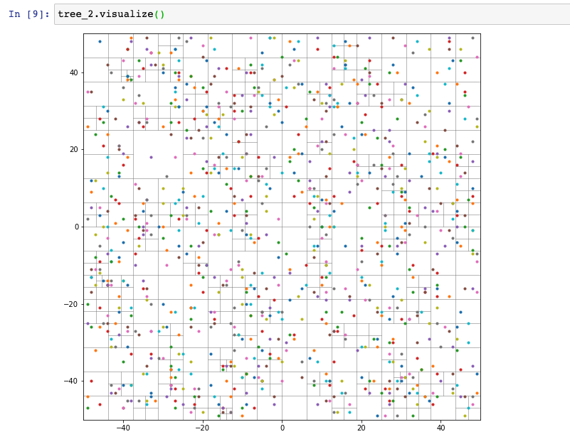

Tutorial
========

This guide seeks to help you learn how to use ``quads``. We'll be covering:

* what a Quadtree is,
* why you might want to use one,
* how to create your first tree,
* how to store extra data within the tree,
* how to search within the tree,
* ...and how to see what your tree looks like.

Let's begin with the basics.

What Is a Quadtree?
-------------------

A `Quadtree`_ is a type of data structure, a form of a `Tree`_. It has a
number of interesting properties, such as:

* A built-in hierarchy
* Sparse structure
* Fast inserts
* Fast lookups
* Ideal for storing spatial or image data

The sparse nature & quick spatial lookups offer a significant improvement
over other structures, such as plain ``list`` objects or the like.

Why You Might Use a Quadtree
----------------------------

The ideal case is when you're dealing with a 2D chunk of data. This includes
things like images, maps, & storing spreadsheet data.

Quadtrees come in several forms. The two we'll discuss here are in storing
point data (for instance, X/Y coordinates) or region data (where an entire
portion of the 2D data is homogeneous).

For instance, the author uses them in a GIS application as an indexing
structure, allowing for fast proximity-based lookups.

There are many more uses you can find online & in other sources.

"Great! I Need a Quadtree. What Now?"
-------------------------------------

There are many libraries out there (in all types of languages) for quadtrees.
But since you're here, you're probably using the `Python`_ programming
language. And you could totally use ``quads``!

If you already have Python, you can go to a shell & run::

    $ pip install quads

This will install ``quads`` globally, which may not always be desirable.
Options like ``virtualenv``, ``poetry`` & others allow for isolated installs.
See their documentation for usage.

Making a Quadtree
-----------------

Making a new quadtree is easy. Fire up a Python shell & enter the following::

    >>> import quads

    >>> tree = quads.QuadTree((0, 0), 20, 20)

The first statement (``import quads``) imports the library for your use.

The second statement is the more interesting one. We're using the
:py:class:`quads.QuadTree` class to make a new quadtree instance. We're setting a center
point of ``(0, 0)`` & providing a width/height of ``20``.

This gives us a tree with `Cartesian`_ coordinates, from ``-10`` to ``10`` on
both the X & Y axis.

But the tree is empty & doesn't do a whole lot without some data. Let's add
some points that we care about to it...::

    >>> tree.insert((3, 5))

This inserts a new point at the coordinates ``(3, 5)``.

We can verify the point is now in the tree with::

    >>> (3, 5) in tree
    True

    >>> (-2, -2) in tree
    False

We also see that a different point ``(2, 2)``, while within the coordinate
space of our quadtree, is **NOT** present in the data. Let's fix that &
add a bunch more points as well::

    >>> tree.insert((-2, -2))

    >>> (-2, -2) in tree
    True

    >>> tree.insert((0, 1))
    >>> tree.insert((-3, 3))
    >>> tree.insert((-2, 4))

    >>> tree.insert((11, 12))
    ValueError: Point <Point: (11, 12)> is not within this node
    (<Point: (0, 0)> - <BoundingBox: (-10.0, -10.0) to (10.0, 10.0)>).

Whoops. We tried to insert a point that didn't fit within the bounds we'd
set when creating the :py::class:`quads.QuadTree`. When that happens, you
get a ``ValueError`` exception warning you of the problem.

Storing Extra Data on Points
----------------------------

Sometimes, just the coordinate values aren't enough to represent what's
being stored. For instance, let's say you're plotting out the board state
of a game of `Checkers`_.

Our board might look like::

    >>> import quads

    # Center is at 4x4 of the 8 by 8 board.
    >>> board = quads.QuadTree((4, 4), 8, 8)

We can store the location of the pieces by setting points. But with what
we've learned so far, we'd have no way to know if a given piece is red
or black.

Enter the ``data=...`` argument::

    # Zero-based offsets, so everything
    >>> board.insert((1, 1), data="red")
    >>> board.insert((0, 0), data="black")
    >>> board.insert((3, 5), data="red")
    >>> board.insert((7, 7), data="black")
    >>> board.insert((4, 4), data="black")

Now we know whose pieces are where. And if it's black's turn, red is in
trouble!

Searching the Quadtree
----------------------

Data's no use to anyone if there isn't a way to find that data. There are
several useful methods for searching a :py:class:`quads.QuadTree`.

As we've already seen, if we just want to detect if a point is present
within the data, we use the ``in`` operator::

    >>> (-2, -2) in tree
    True

If we want the full point back, ``data`` included, we use
:py:meth:`quads.QuadTree.find`::

    >>> board.find((1, 1))
    Point(1, 1, data="red")

If we want all the points within a bounding box, the
:py:meth:`quads.QuadTree.within_bb` method allows you to look up all points
in the provided area::

    >>> bb = quads.BoundingBox(min_x=0, min_y=0, max_x=6, max_y=6)
    >>> tree.within_bb(bb)
    [
        Point(3, 5),
        Point(0, 1),
    ]

.. warning:: **Note:** The data coming out of the ``within_bb`` query isn't
    necessarily in any (obvious) order.

    You'll need to manually sort the points to suit your needs.

    The order is actually a result of a combination of the insertion order
    & the way nodes within the tree are traversed.

And finally, we come to "Nearest Neighbors". The
:py:meth:`quads.QuadTree.nearest_neighbors` method allows you to pick a
location (even if it doesn't exist within the data itself) & pick out the
:py:class:`quads.Point` objects nearest to it. For example::

    # Repeated from above as a reminder; no need to do this if you still
    # have the same instance around.
    # >>> tree = quads.QuadTree((0, 0), 20, 20)
    # >>> tree.insert((3, 5))
    # >>> tree.insert((-2, -2))
    # >>> tree.insert((0, 1))
    # >>> tree.insert((-3, 3))
    # >>> tree.insert((-2, 4))

    >>> found = tree.nearest_neighbors((2, 2), count=4)
    >>> found
    [
        Point(0, 1),
        Point(3, 5),
        Point(-2, 4),
        Point(-3, 3),
    ]

These points come out **in-order**, from closest to furthest from the
provided point. Note that because we limited the ``count=4``, we only got
**four** out of the **five** points back.

No distances are included in the results, but you can calculate them if you
need via :py:func:`quads.euclidean_distance`::

    >>> quads.euclidean_distance(
    ...     quads.Point(2, 2),
    ...     quads.Point(-2, 4),
    ... )
    4.47213595499958

Note that once you leave the bounds of the ``QuadTree`` API, you'll need to
use :py:class:`quads.Point` to represent locations.

Visualizing Your Quadtree
-------------------------

``quads`` itself only requires the `Python`_ standard library, meaning you
don't have to install anything else to use it.

However, if we want to visualize what our ``QuadTree`` looks like, we'll
need to install another library.::

    $ pip install matplotlib

Once you have a ``tree`` built up, you can call :py:func:`quads.visualize`
to draw what the tree's nodes & points look like.::

    >>> quads.visualize(tree)

The tree we've built in this tutorial isn't exceptionally interesting, but
large tree can be quite complex & kinda beautiful:

Where to Go From Here
---------------------

This guide has covered the bulk of the typical interactions with ``quads``.

However, if you have slightly different needs, all the objects within it are
able to be extended/overridden to solve other problems.

For instance, :py:class:`quads.QuadTree` is normally a point quadtree, but
by setting the ``capacity=...`` parameter to ``1``, you can now represent
region quadtrees.

Or supplying a different ``QuadNode`` with extra methods. Or extending the
``Point`` class to handle more/different data.

Enjoy!

.. _`Quadtree`: https://en.wikipedia.org/wiki/Quadtree
.. _`Tree`: https://en.wikipedia.org/wiki/Tree_structure
.. _`Python`: https://www.python.org/
.. _`Cartesian`: https://en.wikipedia.org/wiki/Cartesian_coordinate_system
.. _`Checkers`: https://en.wikipedia.org/wiki/Draughts
